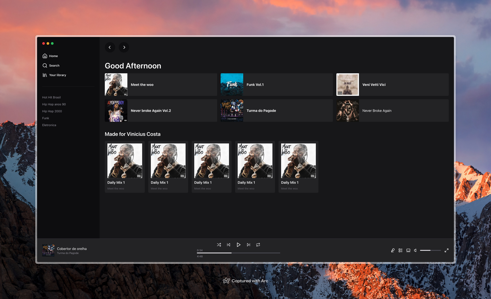

# 📸 Overview:



# 💻 Project:

## Clone da Interface do Spotify.

## Clone Interface Spotify.

# 🚀 Technologies:

### ✔️ NextJS
### ✔️ TailwindCSS
### ✔️ Typescript

# How to run

```
# Clone this repository
$ git clone https://github.com/vinnycosta1998/spotify-ui-clone

# Go to the directory
$ cd spotify-ui-clone

# Install Dependencies
$ pnpm i 

# Run 
$ pnpm run dev
```